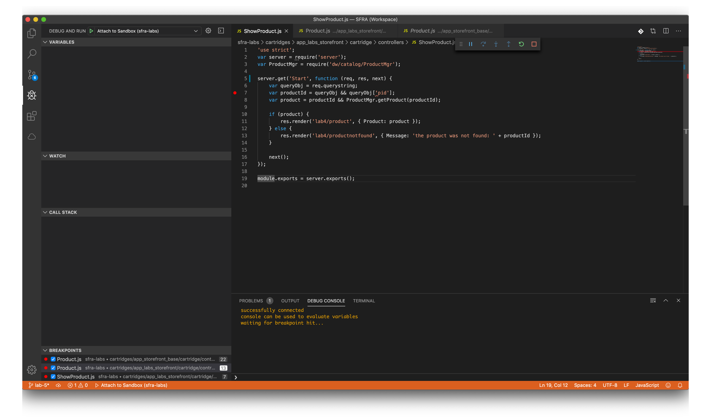

## Lab-3: Using the Controller Debugger

This lab is about using debugger to debug controller execution. For this you need to create a controller, which gets the product by its ID, to create a Debug Configuration, start a Debugging Session and troubleshoot Debug Sessions. Please keep in mind, that described below debugger will work only for backend controllers, but not for frontend JS components.

**Important:** Please keep in mind that leaving debugger session idle for a long time could cause your Sandbox getting freezed.

**1. Get a Product using a Controller.**
   1. Save the *Hello* controller as *ShowProduct*.

   2. Use  *getProduct* method of *ProductMgr* to get product by it's ID, 
   use the code below as an example. Please pay attention, that the controller expects
   productID to be passed as an url parameter. 
   Refer ```req.querystring``` as an object (key, value) mapping to URL query parameters.
   You could also notice that the controller renders two templates, 
   which you didn't do so far - skip this detail for now, 
   it will be explained in the next walkthrough.

```javascript
'use strict';
var server = require('server');
var ProductMgr = require('dw/catalog/ProductMgr');

server.get('Main', function (req, res, next) {
    var queryObj = req.querystring;
    var productId = queryObj && queryObj['pid'];
    var product = productId && ProductMgr.getProduct(productId);

    if (product) {
        res.render('lab4/product', { Product: product });
    } else {
        res.render('lab4/productnotfound', { Message: 'the product was not found: ' + productId });
    }

    next();
});

module.exports = server.exports();
```

**2. Create Debug Configuration**

1. Go to Debugger tab (Ctrl + Shift + D)

    

2. In the dropdown list at the top choose "Add configuration":
    

3. Right after launch.json should be automatically opened and a list of possible configurations shown. Choose "Demandware Debugger", check default values of launch.json - you should see something like at the screen below, and save the file:

    
    


4. Now the debugger should be configured and ready to use.


**3. Start a Debugging Session**   
   1. On the Debugger tab in the dropdown list at the top choose your demandware configuration and start a debugging session (press the green arrow or F5). Debugger panel should appear at the top and a message about successful connection should be printed in the Debug Console at the bottom.

        

   2. Open ShowProduct controller in VSC and add breakpoint on some of variables declaration lines. It should also appear in Breakpoints section in VSC.
        

   3. In a browser call ShowProduct-Start endpoint with random product ID like 123456, the url should look like: "...dware.net/on/demandware.store/Sites-RefArch-Site/en_US/ShowProduct-Main?pid=4"
   4. After url entered debugger will catch the breakpoint, stop execution and show current variables:
        


   5. Press F5 to continue execution. Since you have no templates created, execution should finish with an error (you can see it's details in Request Log).


[**back to labs**](../README.md) | [next](../lab-4/readme.md)
