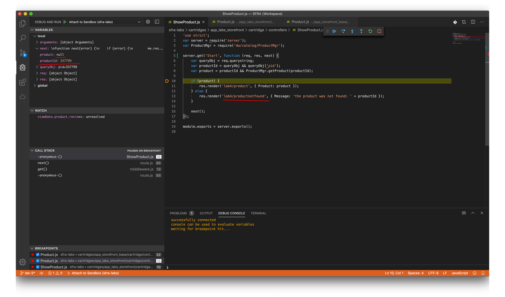

## Lab-5: Templates

1. Create ISML template lab4/product.isml which shows the name of the Product. For this we use name property of the Product object, passed to the template by the controller:
      ```javascript
    <html>
        <head>
            <title>${ Resource.msg('product.show', 'Show Product') }</title>
        </head>
        <body>
            <h1>
                <isprint value="${pdict.Product.name}"/>
            </h1>
            <p>
                <isprint value="${pdict.Product.shortDescription}"/>
            </p>
        </body>
    </html>

    ```

2. Create ISML template lab4/productnotfound.isml with some simple text describing that the system can't find such product.

    ```javascript
    <html>
        <head>
            <title>Product not found!</title>
        </head>
        <body>
            Not found: ${pdict.Log}
        </body>
    </html>

    ```
3. Request the ShowProduct-Start controller appending a URL query string containing the product id:
   http://your-sandbox-name-dw.demandware.net/on/demandware.store/Sites-RefArch-Site/en_US/ShowProduct-Start?pid=337799 (replace "your-sandbox-name" with a proper domain name of your sandbox).

4. Debug and verify.
        
        
5. Commit and Push to new branch, create Pull Request

**Tips**
Check the documentation for a [Resource](https://documentation.b2c.commercecloud.salesforce.com/DOC1/index.jsp?topic=%2Fcom.demandware.dochelp%2FDWAPI%2Fscriptapi%2Fhtml%2Fapi%2Fclass_dw_web_Resource.html&resultof=%22%52%65%73%6f%75%72%63%65%22%20%22%72%65%73%6f%75%72%63%22%20) class that had been used in the Lab.


[**back to labs**](../README.md) | [next](../lab-6/readme.md)
